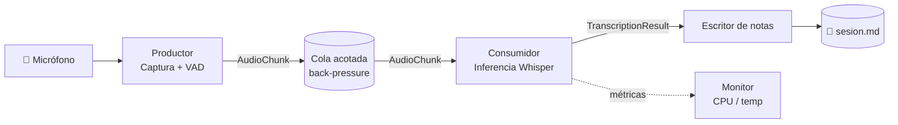

# Sistema de Transcripción Desatendido para Aulas

> [!abstract] Resumen ejecutivo
> Servicio en segundo plano (*background worker*) en Python que captura, segmenta por VAD y transcribe el dictado continuo de un profesor en un aula con ruido y eco, produciendo apuntes estructurados en Markdown. Optimizado para CPU Intel i5 9th Gen sin GPU dedicada, ejecutando inferencia íntegramente local.

---

## 1. Objetivo

Liberar carga cognitiva durante la clase: un proceso desatendido toma las notas mientras el estudiante se concentra en **comprender**, no en transcribir.

### No-objetivos (scope explícito de v1)

- **No** es un sistema de transcripción en vivo con UI.
- **No** hace diarización por hablante (separar voz del profesor vs. preguntas de alumnos).
- **No** requiere conexión a internet — inferencia 100% local.
- **No** corrige ni resume el texto en v1; eso es un post-procesamiento opcional (LLM local) en v2.

---

## 2. Contexto y restricciones de hardware

| Recurso | Capacidad        | Implicación                                          |
| ------- | ---------------- | ---------------------------------------------------- |
| CPU     | Intel i5 9th Gen | *Thermal throttling* bajo carga sostenida >30 min    |
| RAM     | 16 GB            | Holgada — modelo `small` int8 ocupa ~500 MB          |
| GPU     | Integrada Intel  | No utilizable para inferencia Whisper                |
| SO      | Pop!_OS          | PipeWire como servidor de audio (compat. PulseAudio) |

> [!warning] Riesgo principal
> Inferencia continua en CPU → *thermal throttling* → caída progresiva de rendimiento durante una clase de 90 min.
>
> **Mitigación:** cuantización `int8` vía CTranslate2 + procesamiento asíncrono por lotes (nunca streaming bloqueante).

---

## 3. Stack tecnológico

| Capa               | Herramienta            | Justificación                                                    |
| ------------------ | ---------------------- | ---------------------------------------------------------------- |
| Lenguaje           | Python 3.11+           | Ecosistema maduro de audio y ML                                  |
| Inferencia         | `faster-whisper`       | CTranslate2 con int8: ~4× más rápido que `openai-whisper` en CPU |
| Modelo inicial     | `small` (int8)         | Trade-off calidad/latencia razonable; fallback a `base` si throttling |
| Captura de audio   | `sounddevice`          | Bindings limpios sobre PortAudio/PipeWire                        |
| VAD                | `silero-vad`           | Mejor robustez ante ruido de aula que `webrtcvad`                |
| Concurrencia       | `threading` + `queue`  | Suficiente para 1 productor + 1 consumidor                       |
| Salida             | Markdown               | Compatible directo con Obsidian                                  |
| Observabilidad     | `structlog` + `psutil` | Logs estructurados + monitoreo térmico/CPU                       |

---

## 4. Arquitectura

### 4.1 Patrón Productor–Consumidor



- **Productor:** hilo dedicado que captura en bloques cortos (~30 ms), aplica VAD, recorta silencios y empaqueta segmentos válidos como `AudioChunk` en la cola.
- **Consumidor:** hilo independiente que extrae chunks y ejecuta inferencia. **Nunca bloquea la captura.**
- **Cola acotada (`maxsize`):** si el consumidor se retrasa, aplica *back-pressure* o descarte controlado según política configurable.

### 4.2 Capas (Clean Architecture)

```
src/
├── domain/                # Sin dependencias externas. Solo dataclasses y reglas puras.
│   ├── audio_chunk.py
│   └── transcription_result.py
├── application/           # Casos de uso. Orquesta dominio + puertos.
│   └── transcribe_session.py
├── adapters/              # Implementaciones concretas de los puertos.
│   ├── audio/             # IAudioProvider → SoundDeviceProvider
│   ├── inference/         # ITranscriptionEngine → FasterWhisperEngine
│   ├── vad/               # IVoiceActivityDetector → SileroVAD
│   └── output/            # INoteWriter → MarkdownWriter
└── infrastructure/        # Composition root, config, logging, entry point.
    └── main.py
```

> [!info] Puertos del *application layer*
> - `IAudioProvider` — emite chunks crudos de audio.
> - `IVoiceActivityDetector` — clasifica chunks como voz/silencio.
> - `ITranscriptionEngine` — convierte audio → texto.
> - `INoteWriter` — persiste el `TranscriptionResult` en un formato dado.
>
> Cambiar de `faster-whisper` a `whisper.cpp`, o de `sounddevice` a `pyaudio`, requiere **solo** una nueva implementación del puerto correspondiente. El núcleo no se toca.

### 4.3 Entidades de dominio (borrador)

```python
@dataclass(frozen=True)
class AudioChunk:
    samples: np.ndarray       # float32 mono
    sample_rate: int          # 16_000 esperado por Whisper
    started_at: datetime
    duration_s: float

@dataclass(frozen=True)
class TranscriptionResult:
    text: str
    language: str
    avg_logprob: float        # proxy de confianza
    source_chunk_started_at: datetime
    source_chunk_duration_s: float
```

---

## 5. Formato de salida

Archivo Markdown listo para Obsidian, con un bloque por segmento transcrito y *timestamp* relativo al inicio de la sesión:

````markdown
---
fecha: 2026-06-15
asignatura: 
profesor: 
duracion: 01:32:14
modelo: faster-whisper-small-int8
---

# Clase — 2026-06-15 09:00

> [!meta]
> - Idioma detectado: es
> - Segmentos: 142
> - Confianza media (avg_logprob): -0.31

## 00:00:12 — 00:00:47
[texto del segmento...]

## 00:00:51 — 00:01:33
[texto del segmento...]
````

---

## 6. Riesgos abiertos y mitigaciones

| Riesgo                                     | Mitigación propuesta                                                                  |
| ------------------------------------------ | ------------------------------------------------------------------------------------- |
| Eco / ruido del aula degrada calidad       | Pre-procesar con `noisereduce`; evaluar `small.en` (si la clase es en inglés)         |
| *Thermal throttling* sostenido             | Monitor con `psutil`; degradar a modelo `base` si la temperatura excede un umbral     |
| Cola sin cota → consumo descontrolado de RAM | `queue.Queue(maxsize=N)`; política explícita de descarte (FIFO drop o back-pressure) |
| Pérdida de chunks por crash del proceso    | Persistencia opt-in de `AudioChunk` a disco antes de encolar (WAL ligero)             |
| VAD corta frases largas a mitad            | Solapamiento controlado entre chunks; *padding* configurable en silencios cortos      |
| Mezcla de idiomas (es/en) en la clase      | Forzar `language="es"` si se conoce; o detección por chunk con coste extra            |

---

## 7. Siguiente paso — decisión

Tres caminos posibles, ordenados de menor a mayor inversión inicial:

1. **PoC end-to-end mínima** — un solo script (sin Clean Architecture todavía) que valide:
   - Latencia real por segmento.
   - Calidad de transcripción con audio real del aula.
   - Comportamiento térmico tras 30–60 min de carga continua.

   Objetivo: **invalidar supuestos antes de invertir en estructura.**

2. **Definir puertos y entidades del dominio** — empezar por interfaces abstractas (`IAudioProvider`, `ITranscriptionEngine`, `IVoiceActivityDetector`, `INoteWriter`) y entidades puras. Habilita *stubs* y tests unitarios antes de tocar hardware.

3. **Skeleton completo con Clean Architecture** — estructura de carpetas, DI manual, logging, configuración. Sin lógica real todavía.

> [!question] Recomendación
> Empezar por **(1) PoC**. El mayor riesgo del proyecto no es arquitectónico — es **térmico y de calidad de audio**. Una hora invertida en un script sucio puede ahorrar una semana de Clean Architecture construida sobre un supuesto falso.
>
> Una vez validada la viabilidad, el camino **(2) → (3)** es donde tu inversión en arquitectura realmente paga.

---

## Enlaces relacionados

- [[Clean Architecture]]
- [[Domain-Driven Design]]
- [[PipeWire en Pop!_OS]]
